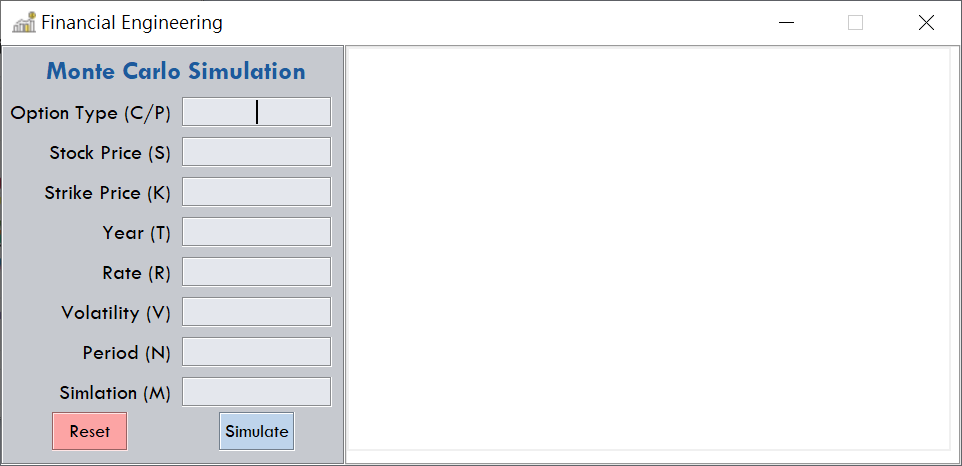
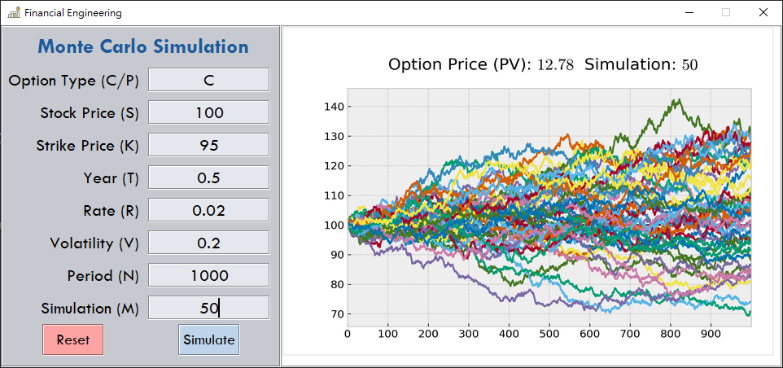

# python-Monte-Carlo-Simulation
> GUI for Monte Carlo Simulation process of stock option

**Introduction**
---
Enter all parameters needed and click simulate.

Result will show up right after(In most of time, it depends on the simulation("M").)


The title of plot tells the present value of the option.


**Notice**
---
1. expected return(mu) was set as zero.
2. Simulation period should set more than ten.

**Screenshots**
---



**Enjoy**
---

```bash
virtualenv env
pip install -r requirements.txt
python MonteCarlo.py
```
