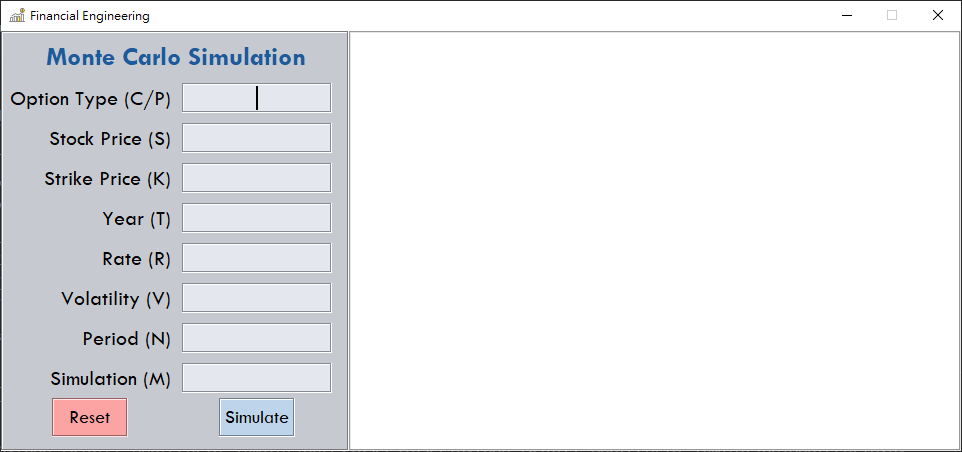

# python-Monte-Carlo-Simulation
> GUI for Monte Carlo Simulation process of stock option

**Introduction**
---
Enter all parameters needed and click simulate. 

Result will show up right after(In most of time, it depends on the simulation times("M").)

Plot represent ten of all simulation process.

And the title of plot tells the present value of the option and simulation times.


**Notice**
---
1. expected return(mu) was set as zero.
2. Simulation period should set more than ten.

**Screen Shot**
---



**Enjoy**
---
1. Clone the project 
```bash
git clone https://github.com/ycy-tw/python-tkinter-MonteCarlo-Simulation.git
```

2. Start Simulating
```bash
cd python-tkinter-MonteCarlo-Simulation
python MonteCarlo.py
```
